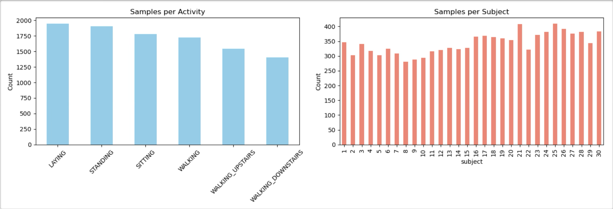
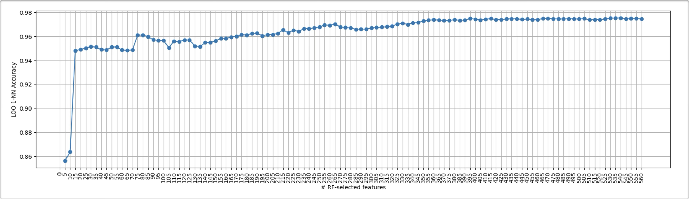
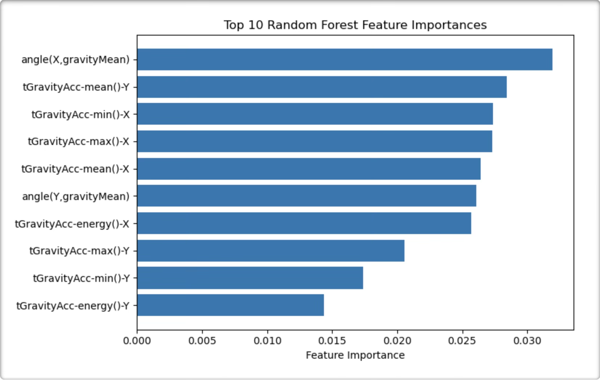
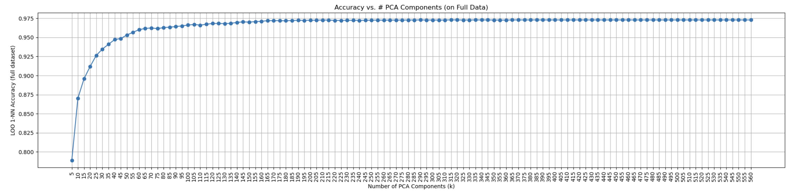
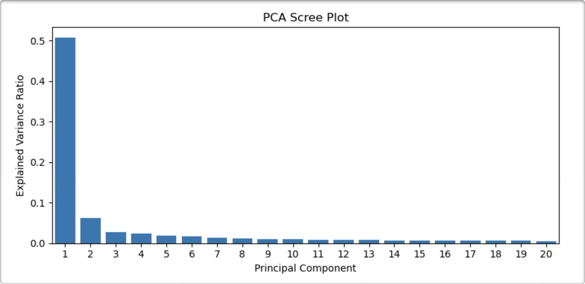
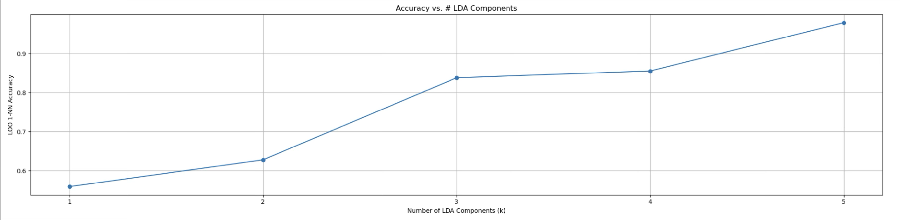
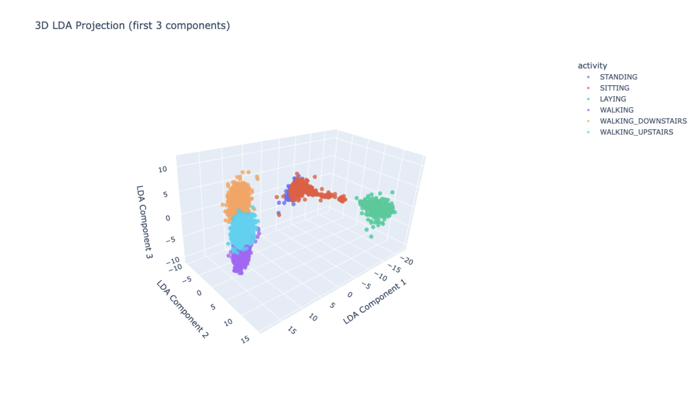
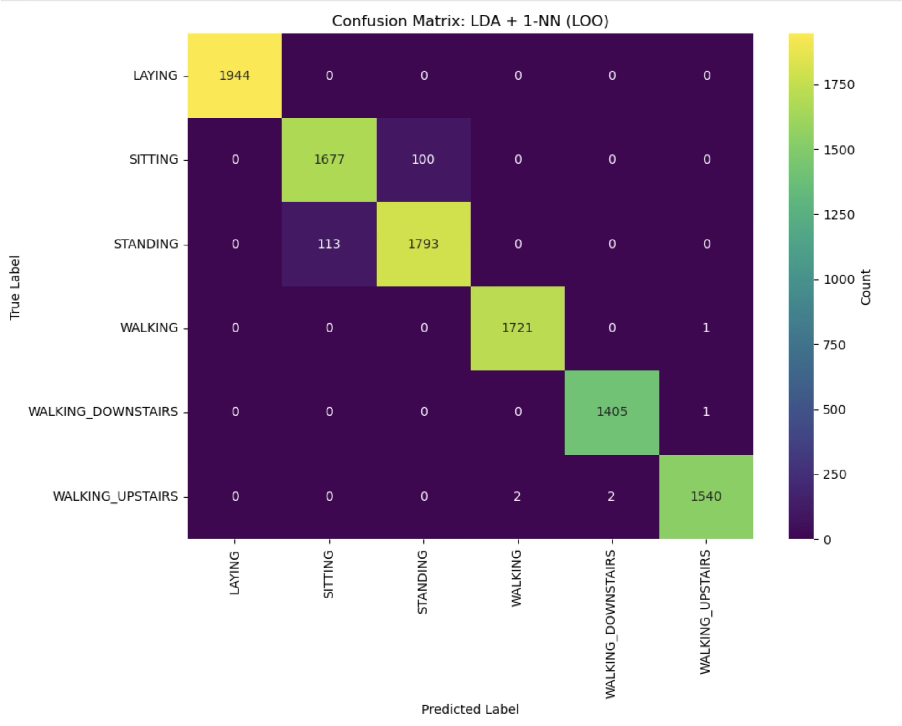

# Decoding Human Activity — Erdős Institute Summer 2025

This project explores **Human Activity Recognition (HAR)** problem using data obtained from devices such as accelerometers and gyroscopes. Specifically, we aim to decode or classify daily activities—such as walking, standing, and laying—based on these sensor recordings. This project was completed during the Erdős Institute’s Data Science Bootcamp (Summer 2025).

##  Repository Guide

This repository contains all materials and code for our project on Human Activity Recognition.

###  Notebooks

- **Dataset Description.ipynb**  
  Introduces the UCI HAR dataset, explains the structure of the data, activities involved, and feature layout.

- **Main notebook.ipynb**  
  Contains the core analysis, including classical ML benchmarks, dimensionality reduction, orientation invariance tests, and evaluation results.

###  Figures

- **Figures/**  
  Stores all figures used in the README and analysis notebooks, including plots for Random Forest, PCA, LDA, and the correlation heatmap.

###  Utilities

- **utils.py**  
  Handles dataset loading and imports commonly used modules for analysis.

## 📂 Dataset

We use the [UCI HAR dataset](https://archive.ics.uci.edu/ml/datasets/human+activity+recognition+using+smartphones), originally published by Anguita et al. (2013). It includes:

- 30 subjects performing 6 daily activities
- 561 engineered features extracted from raw smartphone sensor data

**Activities:**

- Laying
- Standing
- Sitting
- Walking
- Walking upstairs
- Walking downstairs

---

  

## Classical ML Benchmarks
Before presenting our main method, we first reproduced the SVM result reported by [Anguita et al. (2013)](https://www.esann.org/sites/default/files/proceedings/legacy/es2013-84.pdf), and then tested four additional standard classifiers on the original 561-feature space:

| Model               | Setup Summary                    | Accuracy |
|--------------------|----------------------------------|----------|
| SVM (Anguita et al.) | Reported in original study       | 96%    |
| Logistic Regression | `multinomial`, 1000 iterations    | 96%    |
| Random Forest       | 100 trees          | 92%    |
| k-NN                | k = 5                            | 90%    |
| Decision Tree       | Default                          | 86%    |

## Method Description

We use a simple 1-Nearest Neighbor (1-NN) classifier with Euclidean distance to classify activity samples. For validation, we adopt Leave-One-Out cross-validation (LOO-CV), and in some cases examine the resulting confusion matrices.

## Findings

We observed strong correlations among features (see below), so we applied standard dimensionality reduction techniques to reduce redundancy while keeping classification performance high.

### Correlation Analysis

---

###  Random Forest Feature Selection

We ranked features by importance scores computed via Random Forests. By retaining only the top **N = 20** features, we were able to preserve about **95%** of the full-model accuracy.

- Accuracy vs. Number of Features  
  

- Top Feature Importances  
  

---

###  Principal Component Analysis (PCA)

PCA was used to embed the data into a lower-dimensional space. We found that **more than 50 principal components** were needed to maintain over **95% accuracy**.

- Accuracy vs. # Principal Components  
  

- Explained Variance Ratio  
  

---

###  Linear Discriminant Analysis (LDA)

This method was the most effective. Using just **5 LDA components**, we achieved classification accuracy just below **98%**.

- Accuracy vs. # LDA Components  
  

- 3D LDA Projection  
  

- Confusion Matrix  
  

## Robustness to Orientation Changes

We also tested the robustness of our **LDA + 1-NN** method under random **axis permutations** to evaluate its sensitivity to changes in smartphone orientation.

This experiment is motivated by the fact that the original dataset assumes a fixed phone orientation. For example, when worn on the waist as shown in [this video](http://www.youtube.com/watch?v=XOEN9W05_4A), the coordinate system approximately aligns as follows:

- **x-axis**: up–down direction  
- **y-axis**: forward–backward direction  
- **z-axis**: left–right direction  

Our model classifies activities based on features extracted under this consistent alignment. But in real-world use, a phone's orientation can easily change. This raises the key question:

> *Can our method still classify activities correctly if the phone’s orientation changes?*

To test this, we **randomly permuted the x, y, and z axes** in all features (e.g., means, standard deviations). For example, swapping x and y simulates turning the phone sideways.

We found that our method remained robust under these simulated orientation shifts, achieving a classification accuracy of **97%**.

## References:

Anguita, D., Ghio, A., Oneto, L., Parra, X., & Reyes-Ortiz, J. L. (2013). *A Public Domain Dataset for Human Activity Recognition Using Smartphones.* 21st European Symposium on Artificial Neural Networks, Computational Intelligence and Machine Learning (ESANN), 437–442. \\[[Link to dataset](https://archive.ics.uci.edu/dataset/240/human+activity+recognition+using+smartphones)]"
   
